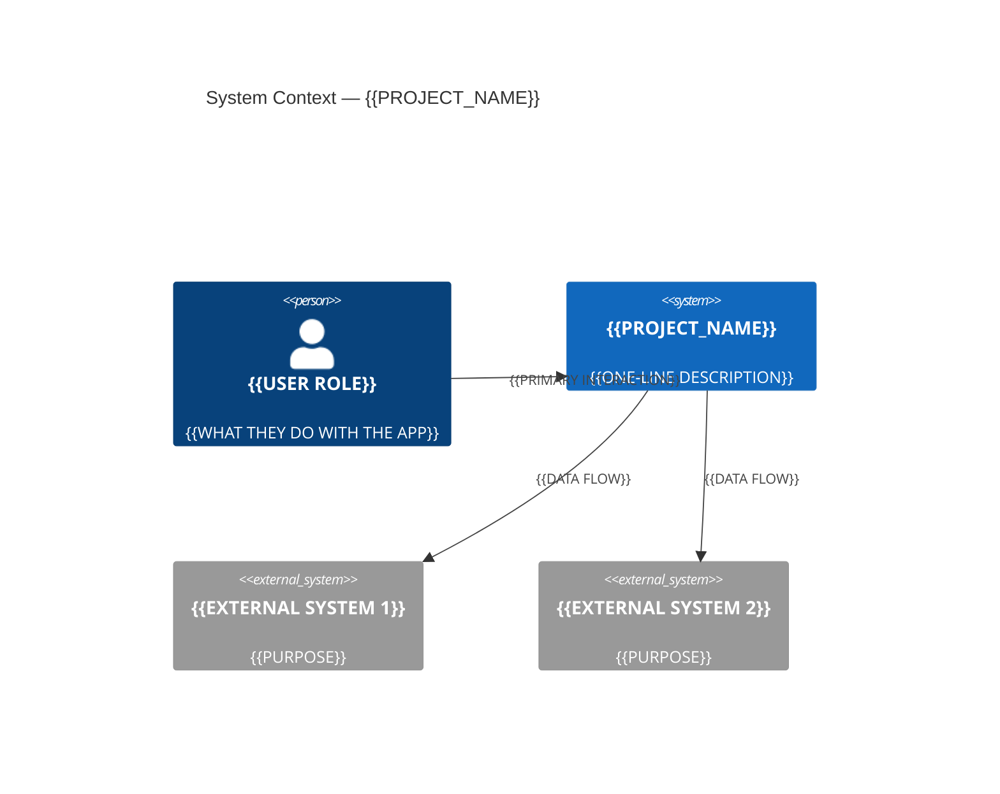
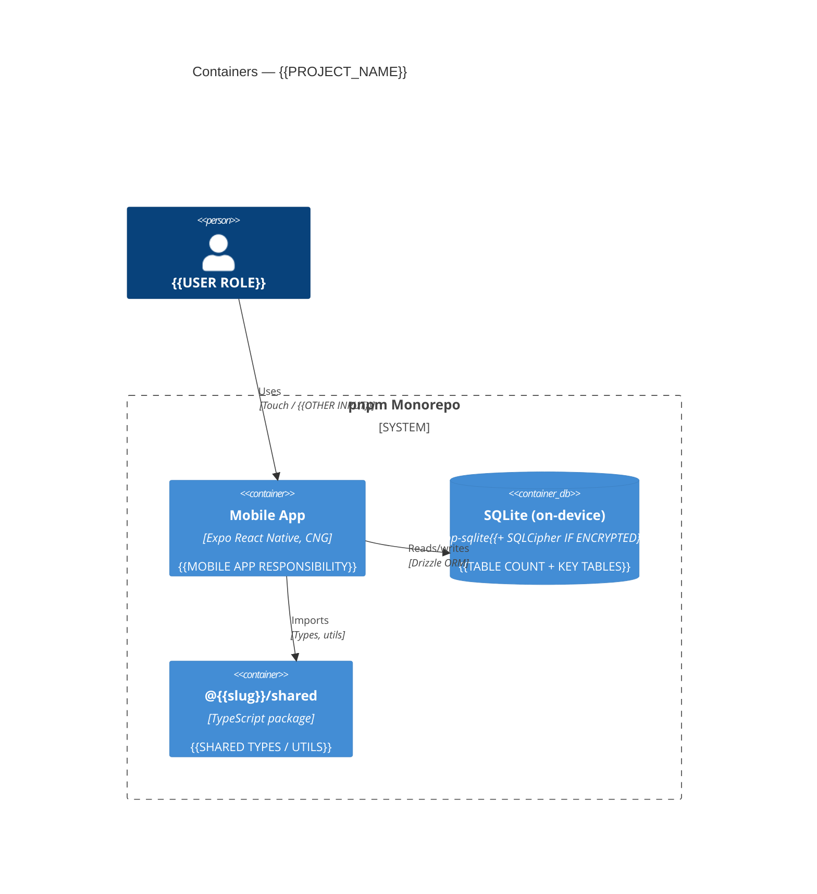
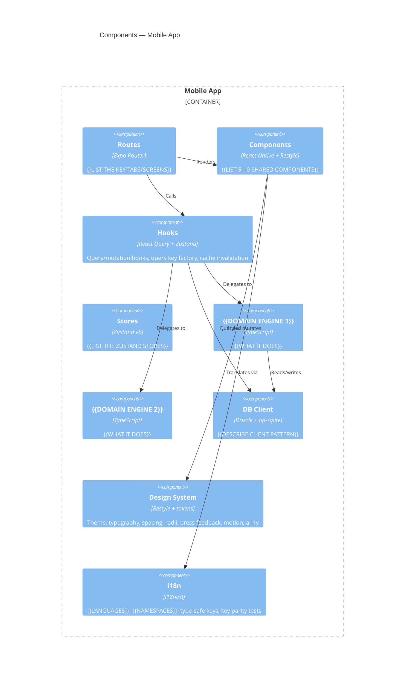
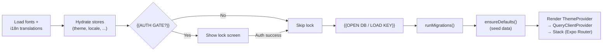

# Architecture

Visual overview of {{PROJECT_NAME}}'s architecture using [C4 model](https://c4model.com) conventions rendered as Mermaid diagrams. Three zoom levels: system context, containers, and components.

*Fill in the diagrams below as the architecture crystallizes. Start with Level 1 on day one — even a rough system context diagram forces you to name the boundaries. Level 2 comes as you build. Level 3 fills in over weeks.*

---

## Level 1 — System Context

What {{PROJECT_NAME}} is, who uses it, and what it talks to.



---

## Level 2 — Containers

The deployable units and shared libraries. Fill in as the monorepo takes shape.



*Extend with server + web containers as they come online.*

---

## Level 3 — Components (Mobile App)

The major modules inside the mobile app and how they interact. Fill in after the first real feature ships.



---

## Data Flow — {{YOUR CORE ALGORITHM OR PIPELINE}}

{{SEQUENCE OR FLOWCHART OF THE MOST IMPORTANT DATA TRANSFORMATION IN YOUR APP}}

*Examples of what to diagram:*
- Ingestion pipeline (file → stage → normalize → promote)
- Matching / reconciliation (candidates → gates → score → route)
- Agent propose-then-confirm (user → LLM → proposal → approval → mutation)
- Sync protocol (device A → server → device B with HLC / CRDT)

Pick the *one* data flow that defines your product. Diagram it. Reference it in every feature plan.

---

## Data Model — Core Aggregates

```mermaid
erDiagram
    {{AGGREGATE_1}} ||--o{ {{AGGREGATE_2}} : "has"
    {{AGGREGATE_2}} ||--o{ {{AGGREGATE_3}} : "contains"

    {{AGGREGATE_1}} {
        text id PK "ULID"
        text name
        text created_at "ISO-8601"
        text deleted_at "nullable — soft delete"
    }

    {{AGGREGATE_2}} {
        text id PK "ULID"
        text {{aggregate_1}}_id FK
        integer {{amount_or_value}} "{{units}}"
    }
```

*Expand as the schema takes shape. Keep it small — 3–7 tables at Level 3, not the full schema.*

---

## Boot Sequence



*Adjust based on whether you have auth, encryption, background tasks, etc.*

---

## Directory Map

```
{{slug}}/
├── apps/
│   ├── mobile/
│   │   ├── app/                    # Expo Router routes
│   │   │   ├── (tabs)/             #   Tab screens
│   │   │   └── _layout.tsx         #   Root layout (boot sequence, auth gate)
│   │   ├── src/
│   │   │   ├── {{domain1}}/        # {{DOMAIN ENGINE 1}}
│   │   │   ├── {{domain2}}/        # {{DOMAIN ENGINE 2}}
│   │   │   ├── db/                 # Schema, client, migrations
│   │   │   ├── hooks/              # React Query queries + mutations (thin wrappers)
│   │   │   ├── stores/             # Zustand v5
│   │   │   ├── components/         # Shared UI
│   │   │   ├── design/             # Restyle theme, tokens
│   │   │   ├── i18n/               # Translations
│   │   │   └── utils/              # format, dates, haptics, logger
│   │   ├── modules/                # Local Expo modules
│   │   └── plugins/                # CNG config plugins
│   ├── server/                     # {{IF APPLICABLE}}
│   └── web/                        # {{IF APPLICABLE}}
├── packages/
│   └── shared/                     # Shared types + utils
├── docs/                           # Architecture, specs, plans, design
├── scripts/                        # pelaggio, sync checks, etc.
└── .github/workflows/              # CI, EAS preview, production
```

---

## Key Architectural Invariants

These are load-bearing constraints. Violating them causes data quality regressions.

| Invariant | Enforced by |
|---|---|
| {{INVARIANT 1}} | {{MECHANISM}} |
| {{INVARIANT 2}} | {{MECHANISM}} |
| Raw data preserved alongside normalized | `raw_payload` / `{{raw_field}}` columns |
| Timestamps as ISO-8601 UTC | `nowISO()` passed explicitly |
| Soft deletes only | `deleted_at` column |

*This table mirrors the "Correct" section of `.claude/skills/_rubric.md`. Keep them in sync — any invariant here should be a bullet in the rubric, and vice versa.*
