# architecture assurance view

> What durable architectural intent does Pelaggio currently preserve?

Generated from shadow-graph.json schema 0.3.0 via ci/assurance-views.ts. Do not edit this projection by hand.

```mermaid
flowchart TB
  CLM_0001["untrusted-input"]
  CLM_0002["bounded-execution"]
  CLM_0003["secret-minimization"]
  CLM_0004["passive-install"]
  CLM_0005["control-authority-authenticated"]
  CLM_0006["no-self-authorization"]
  CLM_0007["landing-fenced"]
  CLM_0008["verifiable-custody"]
  CLM_0009["blocker-survives-until-refuted"]
  CLM_0010["evidence-judgment-disposition-separated"]
  CLM_0011["recoverable-stops"]
  CLM_0012["resume-by-reconciliation"]
  CLM_0013["autonomy-above-safety-floor"]
  CLM_0015["provider-differences-explicit"]
  CLM_0016["independent-evaluation"]
  CLM_0017["mechanism-policy-separated"]
  CLM_0018["work-ownership-authoritative"]
  CLM_0019["deterministic-safety-floor"]
  CLM_0020["architectural-intent-single-source"]
  CLM_0021["no-undeclared-egress"]
  CLM_0022["value-and-negotiability-are-human"]
  CLM_0023["local-autopilot-success-is-ready-for-review"]
  CLM_0007 -->|specializes| CLM_0006
  CLM_0009 -->|specializes| CLM_0019
  CLM_0010 -->|specializes| CLM_0019
  CLM_0013 -->|specializes| CLM_0006
  CLM_0018 -->|specializes| CLM_0006
  CLM_0019 -->|specializes| CLM_0006
```

