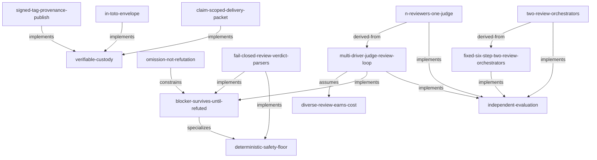

# review assurance view

> Why does the current review strategy exist, what assumptions does it rely on, and what survives if the strategy changes?

Generated from shadow-graph.json schema 0.3.0 via ci/assurance-views.ts. Do not edit this projection by hand.

