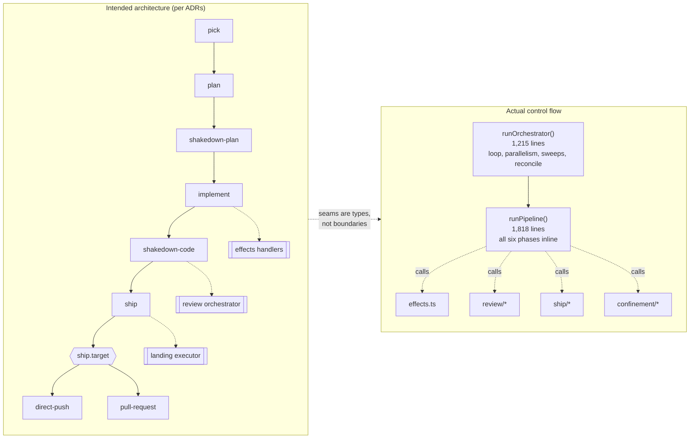

# System map: intended seams vs. where the code actually is

Status: analysis, pre-decision. Measured 2026-08-08 at `54fc61e`.
**Corrected after review.** The first draft claimed "there is no runtime architecture doc at
all". False: `docs/agent-context/pipeline.md` (117 lines) documents the step sequence,
step-provider seam, worktree isolation, effects manifests, probe timing, cross-process
session peers, and parking. `architecture.md` covers packaging; `pipeline.md` covers runtime.

Worse, `coherence-audit.md` — written an hour earlier and cited by this document as support —
*already says* `pipeline.md` documents much of this. Two of my own documents contradicted each
other. Any index proposed here must define its relationship to `pipeline.md` rather than
recreate it, which is the exact drift this document claims to be fixing.

## The finding

`pipeline.ts` is 3,498 lines. That is not the problem. The problem is **where** those lines are:

| Function | Lines | Share of file |
|---|---|---|
| `runPipeline` | **1,818** | 52% |
| `runOrchestrator` | **1,215** | 35% |
| everything else (11 functions) | 465 | 13% |

**87% of the file is two functions.** `runPipeline` contains six inline phase sections —
`Resolve item + worktree`, `Detect quick mode`, `Plan + Shakedown-plan`, `Implement`,
`Shakedown-code`, `Ship` — as comment banners inside one scope, not as units.

## The mismatch, stated precisely

The ADRs describe a system **of seams**. Nearly all of them are real design commitments:

- ADR-0022 — fixed six steps, policy-triggered review, distinct orchestrators
- ADR-0020 — multi-driver provider seam, data-only capability model
- ADR-0021 — enforcement as tool-mediation; placement as effects-as-handlers
- ADR-0014 — mechanism/policy separation as the spine
- ADR-0025 / 0026 — landing executor; fence-or-reconcile classification
- `ship.target` owns direct-push vs PR behaviour
- `RoadmapSource` adapters; `STEPS` as the source of truth

**Corrected after review: the seams are NOT nominal, and the first draft was wrong to say so.**
`StepProvider` in `step-runner.ts` is an explicit provider boundary (ADR-0020), and
`PipelineDeps` makes `runStep`, `RoadmapSource`, effects dispatch and ship bookkeeping
independently replaceable — which is why the test suite can drive whole cycles with mocks at
all. `ship/`, `review/`, `confinement/` and `roadmap/` are real modules with real boundaries.

The accurate, narrower finding: **what is missing is phase choreography.** The six phases are
sequenced inline in one 1,818-line scope rather than being units. The seams the ADRs describe
mostly exist; the *ordering and state-threading between them* has no structure.

## Why this causes the test and doc problems rather than sitting alongside them

**Tests.** There are no units to test, so `pipeline.test.ts` drives whole cycles through a
1,818-line function with mocks. That is why a test can pass *for an unrelated reason* — two
`#369` tests passed because harness artifacts were being committed into the branch, satisfying
the plan-only ship guard rather than the property under test. Integration-only testing at this
scale makes vacuity (#478) hard to see and easy to write.

**Docs.** There is no module a doc can describe. `architecture.md` covers packaging because
that is the only structure that exists at file granularity. The load-bearing facts an
implementer needs — probe error-swallowing, record pid lifetime, `dispose()` semantics,
registration-skip paths — belong to behaviours inside these two functions, so they have no
natural home and end up undocumented (see `coherence-audit.md`).

**Change cost.** Adding attempt identity (#467) required threading a memoized closure through
one 1,818-line scope: `itemId` is declared at `pipeline.ts:906` while the memoized `itemRunId`
is defined at `:282`, hundreds of lines before the variable it closes over is assigned.

*Corrected:* the first draft said the fix "still missed `appendDecisions`" and cited wrong line
numbers. The **initial patch** missed `appendDecisions`; the gate caught it and `f121a0f`
converts all four sites, including that one, with an explanatory comment. Describing an
intermediate state as the final one overstated the case.

## Proposed decomposition — mapped to intent, not to size

The point is not "smaller files". It is that **each ADR seam should be a module boundary**, so
the intended architecture and the code agree.

| Extract | From | Intent it realizes |
|---|---|---|
| `pipeline/phases/*.ts` — **one per `STEPS` entry** | `runPipeline` inline sections | ADR-0022: `STEPS` is the source of truth |
| `orchestrator/loop.ts`, `orchestrator/sweeps.ts` | `runOrchestrator` | separates campaign control from cycle execution |
| (already good) `ship/`, `review/`, `confinement/`, `roadmap/`, `step-runner.ts` | — | these *are* the model |

**Two rows withdrawn after review:**
- `pipeline/step-runner-seam.ts` — would **duplicate an existing boundary**. `StepProvider` /
  `runStep` already is the ADR-0020 seam; `pipeline`'s inline step wrapper is cycle
  orchestration (budget, confinement, effects, logging), not provider dispatch. Extracting it
  under that name would create a misnamed second seam.
- `pipeline/cycle-context.ts` "realizes ADR-0026 P4" — it does not. P4 additionally requires an
  agent-inaccessible anti-rollback authority and authority-side fencing at every effect
  consumer. A context module is a refactor, not that primitive.

**The phase cut must follow `STEPS`, not the comment banners.** The banners are `Resolve`,
`Detect quick mode`, `Plan + Shakedown-plan`, `Implement`, `Shakedown-code`, `Ship` — which is
not the same partition: `Detect quick mode` is not a step, and `Plan + Shakedown-plan` is two.
`STEPS` is pick/plan/shakedown-plan/implement/shakedown-code/ship, and it is the source of
truth per ADR-0022. The first draft said "one per phase" without resolving this, which an
implementer could not act on.

## The index this should become

`docs/agent-context/architecture.md` should answer, in one screen: *what are the seams, which
module owns each, and which ADR governs it.* Today it answers none of those. Proposed shape:

1. **Runtime seams table** — seam → owning module → governing ADR → built/planned.
2. **The cycle diagram** above, with the phases as real modules once extracted.
3. **Load-bearing behaviours** — the short factual list currently discoverable only by being
   wrong in review.
4. **What is NOT built** — pointing at target-state docs rather than mixing them in
   (`coherence-audit.md` move A).

## Sequencing and risk

Decomposition is a large, high-risk refactor of the most defect-dense code in the repo, and
this session's evidence is that the test suite around it is not strong enough to catch
regressions confidently — five vacuous tests, fixtures diverging from production, 9 spurious
failures under inode pressure.

So the honest order is: **the index first, extraction second, and #478's test audit before or
alongside the extraction rather than after.** Writing the map is cheap, immediately useful, and
is the artifact that makes the extraction reviewable. Extracting first, against a test suite
we have just measured as unreliable, is how a refactor silently changes behaviour.

## Least certain

Whether `runOrchestrator` should be decomposed at all, or replaced. It accumulated loop,
parallelism, sweeps, reconcile dispatch and status rendering; several of those are ADR-0026 P5
reconcilers that do not exist yet (#470). Extracting it now may mean extracting code that the
reconciler work will rewrite.
